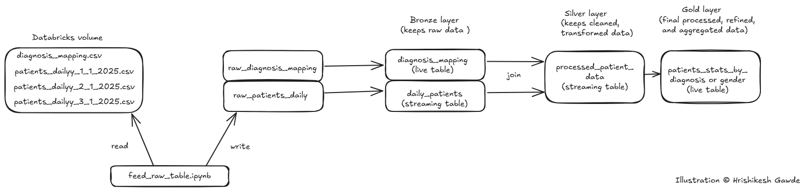

# Healthcare Delta Live Table Pipeline with Medallion Architecture

## Introduction
This project demonstrates the implementation of the Medallion Architecture using Delta Live Tables (DLT) in Databricks. It is designed to showcase how raw healthcare data can be incrementally ingested, cleaned, transformed, and aggregated across Bronze, Silver, and Gold layers for structured analytical use.

## Problem Statement
In healthcare analytics, patient data is generated daily and needs to be ingested incrementally. Additionally, diagnosis metadata must be frequently joined to understand the broader health landscape. Traditional approaches often struggle with real-time updates and structured lineage. This project solves the problem using Delta Live Tables and Medallion Architecture, enabling managed ingestion, transformation, and aggregation pipelines.

## Architecture
The architecture follows the Medallion pattern:
- Bronze Layer: Stores raw ingested data.
- Silver Layer: Stores cleaned and enriched data.
- Gold Layer: Stores aggregated business-level data for insights.

## Technology Used
- Databricks
- PySpark
- Delta Lake
- Delta Live Tables (DLT)
- SQL (Declarative Transformation Logic)

## Dataset Used
- diagnosis_mapping.csv: diagnosis_code, diagnosis_description
- patients_daily_dd_mm_yyyy.csv: patient_id, name, age, gender, address, contact_number, admission_date, diagnosis_code

## Scripts for Project
#### feed_raw_table.ipynb:
Reads CSV files from the Databricks volume and writes them to raw Delta tables:
- raw_diagnosis_mapping (static)
- raw_patients_daily (streaming ingestion from daily CSV files)

#### healthcare_dlt_processing.ipynb:
Contains SQL-based declarative logic for defining:
- Bronze Layer:
  - diagnosis_mapping (live table from raw_diagnosis_mapping)
  - daily_patients (streaming table from raw_patients_daily)

- Silver Layer:
  - processed_patient_data (streaming join of diagnosis_mapping and daily_patients)

- Gold Layer:
  - patients_stats_by_diagnosis (aggregates patient count, age stats by diagnosis)
  - patients_stats_by_gender (aggregates patient count, age stats by gender) 

  #### dlt_pipeline_workflow.json:
  This file is automatically generated by Databricks when we create or export a job (workflow). It contains the full configuration of Databricks Workflow in JSON format.

## Output and Impact
This pipeline provides aggregated insights from raw patient records:

#### Output Metrics (Gold Layer)
- From patients_stats_by_diagnosis: (diagnosis_description, patient_count, avg_age, unique_gender_count, min_age, max_age)
- From patients_stats_by_gender: (gender, patient_count, avg_age, unique_gender_count, min_age, max_age)

These outputs enable hospital administrators and health data analysts to monitor patient trends based on demographics and diagnosis in real time.

## My Learnings
- Practical implementation of the Medallion Architecture in Databricks.
- Hands-on with Delta Live Table (DLT) pipelines and development mode execution.
- Streaming ingestion and materialized view creation using live tables.
- Writing SQL-based DLT pipelines using declarative logic.
- Building automated and scalable healthcare data workflows using Delta Lake.

